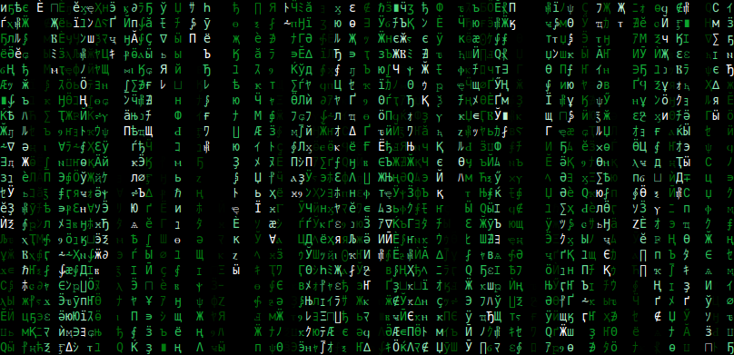

# Matrix digital rain effect in the terminal

Implements the [Matrix digital rain](https://en.wikipedia.org/wiki/Matrix_digital_rain) effect in the terminal
This code has also been published on [Rosetta Code](https://rosettacode.org/wiki/Matrix_digital_rain#Rust)
It was part of a [live coding session](https://www.meetup.com/rustcologne/events/286890733/) of the [Rust User Group Cologne](https://rust.cologne) to teach some basic Rust coding skills to beginners. For simplicity this code doesn't have any error handling when writing to the terminal.